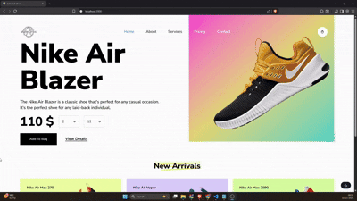
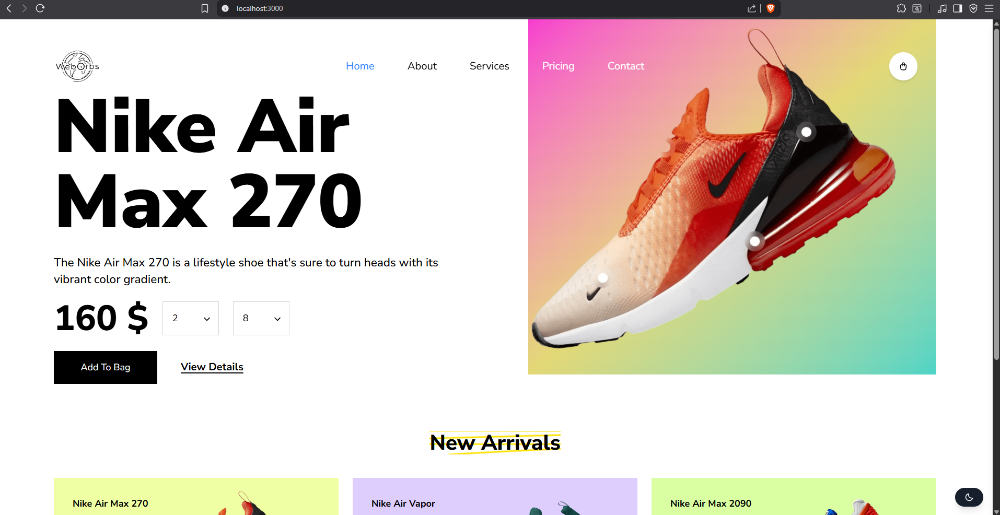
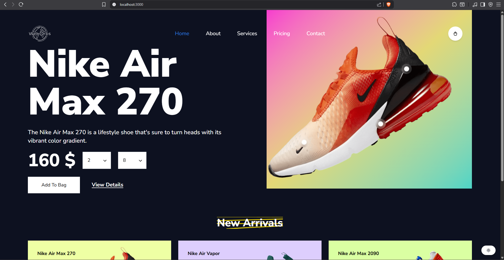
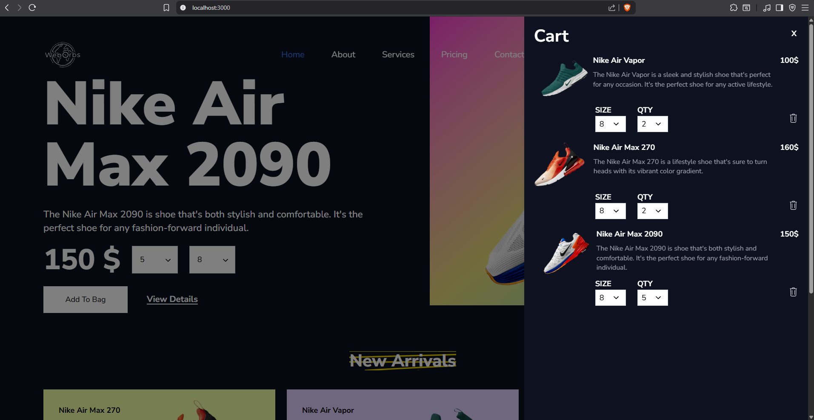

# 👟 WebOrbs | Show Store | Created By - Vikram Maurya



[](https://shoe-store-react-tailwind.vercel.app/)
[](https://github.com/imvikrammaurya/shoe-store-react-tailwind)


## 📖 About The Project

Welcome to **WebOrbs Shoe Store**, a fully functional, modern e-commerce landing page built to demonstrate the power of **React** combined with the new **Tailwind CSS v4**.

This project replicates a premium shopping experience for the Nike Air Max line. It focuses on high-performance UI, smooth animations, and a seamless user experience across all devices. It handles state management for the shopping cart and persists user preferences (like Dark Mode) using local storage.

### ✨ Key Features

- **🎨 Dynamic Theming:** Fully supported **Dark Mode** & Light Mode with persistent local storage.
- **📱 100% Responsive:** A mobile-first approach ensuring the site looks perfect on phones, tablets, and desktops.
- **🛒 Functional Cart:** Users can select sizes, adjust quantities, and add items to a dynamic shopping cart.
- **✨ Custom Animations:** \* Floating shoe animation (`@keyframes float`)
  - Wiggle effects on hover
  - Smooth fade-in transitions on page load
- **⚡ Modern Tech Stack:** Built with Vite for lightning-fast performance.

---

## 📸 Screenshots

|                 Light Mode                 |                Dark Mode                 |                  Cart Demo                   |
| :----------------------------------------: | :--------------------------------------: | :------------------------------------------: |
|  |  |  |

## 🛠️ Tech Stack

This project was built using the latest frontend technologies:

- **Framework:** [React 19](https://react.dev/)
- **Build Tool:** [Vite](https://vitejs.dev/)
- **Styling:** [Tailwind CSS v4](https://tailwindcss.com/)
- **Icons:** [React Icons](https://react-icons.github.io/react-icons/)
- **Utilities:** `tailwind-merge` (for class conflict resolution)

---

## 🚀 Getting Started

Follow these steps to run the project locally on your machine.

### Prerequisites

- Node.js (v18 or higher recommended)
- npm

### Installation

1.  **Clone the repository**

    ```bash
    git clone https://github.com/imvikrammaurya/shoe-store-react-tailwind.git
    ```

2.  **Navigate to the project folder (Your Folder)**

    ```bash
    cd tailwind-shoes
    ```

3.  **Install dependencies**

    ```bash
    npm install
    ```

4.  **Run the development server**

    ```bash
    npm run dev
    ```

5.  **Open your browser**
    Visit `http://localhost:3000` to view the app.

---

## 🧠 What I Learned

This project was a deep dive into modern frontend styling and logic. Key takeaways include:

- **Tailwind v4 Configuration:** Learned how to use the new `@theme` and `@variant` directives in CSS to create custom animations and handle dark mode without a traditional `tailwind.config.js`.
- **Complex State Management:** Managing the state of the Shopping Cart (adding items, updating quantities) and passing data between siblings using Props and State lifting.
- **Component Reusability:** Created modular components like `Card`, `Select`, and `Nav` to keep the codebase clean and maintainable.
- **CSS Animations:** mastered `@keyframes` within Tailwind to create engaging "wiggle" and "float" effects that enhance user engagement.

---

## 📬 Contact

**Vikram Maurya** _Brand: WebOrbs_

- GitHub: [@imvikrammaurya](https://github.com/imvikrammaurya)
- Project Link: [https://github.com/imvikrammaurya/shoe-store-react-tailwind](https://github.com/imvikrammaurya/shoe-store-react-tailwind)
- Project Live Link: [WebOrbs Shoe Store](https://shoe-store-react-tailwind.vercel.app/)

---

You can use it without worry, anywhere you want to. Just don’t forget to follow me.
